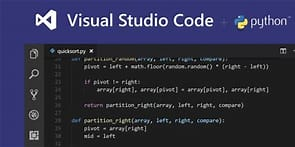

# HTML笔记 {ignore}

[toc]

## 文本元素

### h
h1-h6:表示标题
h$*6>{$级标题}

### p
表示段落
lorem：乱数假文
p*6>lorem100

### span
无实义，仅用于设计样式文本元素

### pre
预格式化
在pre元素中的文本不会出现空白折叠

### code
显示代码时，通常外套code元素
code style="white-space:pre"

### title属性
全局属性，显示鼠标悬浮时的描述

## HTML实体
1.&单词;
2.&#数字;
>常用：<：&lt;(less then)
>&gt;:&gt;(greater then)
 (空格):&nbsp;(non-breaking space)
 (版权符号):&copy;
&:&amp;

## a元素
超链接
a[href="#chapter$"]*6>{章节$}
((h2[id="chapter1"]>{章节1})+p>lorem)*6

### href属性
hyper reference
1.普通链接
2.锚链接
id="chapter2"
 #chapter2
同文件夹下不同文件跳转直接href=“index.html#chapter3”
3.功能链接
-执行JS代码,javascript:
-发送邮件,mailto:
要求安装邮件发送软件：exchange
-拨号,tel:
要求安装拨号软件，或移动端访问

### target属性
表示跳转窗口位置
取值：_self：在当前窗口打开，默认值
_blank:在新窗口打开

## 路径的写法

### 绝对路径和相对路径
-绝对路径(站外资源)：协议名://主机名:端口/路径
端口：如果协议是http协议，默认端口号80；如果协议是https协议，默认端口号为443
-相对路径(站内资源)
以./开头，可以省略
./表示当前资源所在目录，可以书写../表示返回上一级目录

## 图片元素
alt+ctrl+v
复制图片，添加图片

### img元素
src属性：source
alt属性：当图片资源失效时，将使用该属性的文字替代图片

### 和a元素连用

### 和map元素连用
name属性
引用时：usemap="#"
map的子元素：area
circle圆
rectangle矩形
poly多边形
ps,pxcook、

### 和figure元素连用
子元素：figcaption(标题)

## 多媒体元素

### video(视频)
(布尔属性)：可以不用书写属性值
controls:控制控件的显示，取值只能为controls
autoplay:自动播放
muted:静音播放
loop:循环播放
为了兼容性，可在中间加source再添加不同的格式

### audio(音频)
同视频

## 列表元素

### 有序列表
-ol(列表):ordered list
type表示列表前面的显示type=“1”i(尽量避免使用，应用css)
-li(列表项):list item
alt+shift+下键：复制选中的内容
-reserved:倒着显示

### 无序列表
把ol改为ul: unordered list
常用于制作菜单

### 定义列表
常用于术语的定义
dl:definition list
dt:definition title
dd:definition description

## 容器元素
该元素代表一块区域，内部用于放置其他元素

### div元素
无语义

### 语义化容器元素
header：通常用于表示页头或文章头部
footer：通常用于表示页脚或文章尾部
article:通常用于表示文章正文
section：通常用于表示文章章节
aside：通常用于表示侧边栏

## 元素包含关系
1、容器元素中可以包含任何元素
2、a元素中几乎可以包含任何元素
3、某些元素有固定的子元素(ul>li,ol>li,dl>dt+dd)
4、标题元素和段落元素不能相互嵌套，并且不能包含容器元素